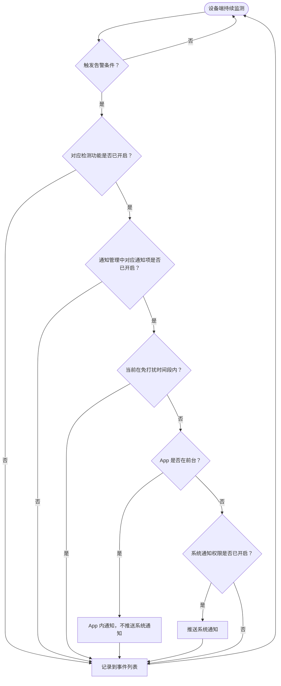

# BBM 婴儿看护摄像头 APP 功能需求文档（结构化版）

---

## 一、文档信息

| 项目 | 内容 |
|---|---|
| 文档状态 | 草稿 |
| 版本 | v0.1（结构化整理版） |
| 负责人 | TBD |
| 最后更新 | 2026-04-10 |
| 原始文档 | bbm-app-requirements.md |

### 1. 修订记录

| 版本 | 日期 | 修改内容 | 修改人 |
|---|---|---|---|
| v0.1 | 2026-04-10 | 初稿 | 王博 |
| v0.1-结构化版 | 2026-04-13 | 在不改变业务含义的前提下，将平铺式需求整理为模块化表格表达 | Claude |

---

## 二、产品背景与目标

### 1. 产品背景

本文档描述 Momcozy App 接入 BBM 婴儿看护摄像头系列的功能需求。本期涉及两款设备。

| 设备 | 设备定位 | 核心特点 | App 侧差异 |
|---|---|---|---|
| BBM 04M | 带电池的高配摄像头 | 正常工作待机 6-10 小时；支持完整 AI 识别算法 | 支持完整智能看护能力 |
| BBM 05 | 常电低成本摄像头 | 无电池；成本较低；AI 识别算法少部分 | 除部分 AI 能力外，其余 App 侧功能与 BBM 04M 一致 |

### 2. 技术背景

| 项目 | 说明 |
|---|---|
| 底层能力 | 继续使用涂鸦 SDK |
| UI 层 | 由 Momcozy 自主开发 |
| 重构目标 | 替换原涂鸦 SDK UI 方案，形成品牌统一的交互体验 |
| 配网能力 | 前期沿用涂鸦配网；待内部原子化平台支持后切换 |

### 3. 核心价值

| 核心价值 | 说明 |
|---|---|
| 安全看护 | 实时查看婴儿画面，异常时第一时间告警 |
| 智能检测 | 支持哭声、移动、温湿度等多维度自动识别 |
| 安抚互动 | 支持远程播放安抚音乐、语音对讲 |

### 4. 项目目标

| 目标 | 验收方向 |
|---|---|
| 完成设备接入 | BBM 04M 和 BBM 05 均可完成从直播、回放到智能看护的完整功能闭环 |
| 提升体验 | App 使用体验大幅领先原 BM04 系列 |
| 商用交付 | 功能完整、体验流畅，可直接面向终端用户发布 |

---

## 三、一页式摘要

### 1. 本期结论摘要

| 维度 | 结论 |
|---|---|
| 本期目标 | 完成 BBM 04M / BBM 05 在 Momcozy App 内的直播、回放、相册、设置、智能看护完整闭环 |
| 产品重点 | 用自研 UI 替换原涂鸦 UI 方案，突出品牌一致性、智能看护能力和远程互动体验 |
| 汇报重点 | 告警能力、通知管理、功能设置、设备差异、待确认项 |
| 交付形态 | 面向终端用户可发布的商业化 App 功能方案 |

### 2. 本期做什么 / 不做什么

| 类型 | 内容 |
|---|---|
| 本期做 | 首页设备卡片、设备详情页、录像回放、相册、设备信息、智能看护 / 告警设置、功能设置、通用设置 |
| 本期不做 | 自研设备配网流程、自研云存储开通与付费页面 |
| 依赖外部能力 | 涂鸦 SDK、内部原子化平台（后续） |

### 3. 核心能力清单

| 能力域 | 核心能力 |
|---|---|
| 看护能力 | 移动侦测、哭声检测、声音检测、宝宝在位检测、安全围栏、禁区、温湿度告警 |
| 实时交互 | 直播、全屏观看、语音对讲、云台控制、抓拍、录像、画中画 |
| 安抚能力 | 安抚音乐快捷播放、播放模式、音量调节、哭声触发自动播放 |
| 内容管理 | SD 卡回放、云回放、时间轴定位、事件筛选、截图/录像相册管理 |
| 设置能力 | 设备信息、通知管理、存储设置、画面设置、省电模式、固件升级、共享设备 |

### 4. 设备差异摘要

| 设备 | 电源形态 | AI 能力 | 展示 / 交互差异 | 业务影响 |
|---|---|---|---|---|
| BBM 04M | 带电池 | 支持完整 AI 识别算法 | 展示电量、充电、省电模式、休眠 / 唤醒等状态 | 更强调续航、功耗与移动看护场景 |
| BBM 05 | 常电 | AI 能力少部分缩水 | 无电池相关状态；其余 App 侧体验尽量保持一致 | 更强调基础看护和常电使用场景 |

### 5. 关键待确认项摘要

| 待确认项 | 当前状态 | 影响模块 |
|---|---|---|
| 视频流端到端延迟目标 | TBD | 直播体验、性能验收 |
| 首帧加载时长目标 | TBD | 首页预览、设备详情页直播 |
| iOS / Android 最低版本 | TBD | 兼容性、发版策略 |
| 断网重连机制 | TBD | 直播、回放稳定性 |
| 视频流加密协议 | TBD | 安全、加载文案一致性 |

---

## 四、功能范围

### 1. 本期包含

| 模块 | 核心内容 | 交付形态 |
|---|---|---|
| 首页（设备列表） | 设备卡片展示、预览播放、状态呈现 | App 页面 |
| 设备详情页 | 实时直播、操作控制、安抚音乐、智能看护事件 | App 页面 |
| 录像回放 | SD 卡回放、云回放、时间轴、事件筛选 | App 页面 |
| 相册 | 截图与录像管理、全屏预览、分享删除 | App 页面 |
| 设置 | 设备信息、智能看护配置、功能设置、通用设置 | App 页面 |

### 2. 不在本期范围

| 范围项 | 处理方式 | 备注 |
|---|---|---|
| 设备配网 / 添加设备 | 使用涂鸦 SDK，配网页面在涂鸦后台配置 | App 不自行开发配网流程；后续原子化能力上线后切换至 Momcozy 自有后台 |
| 云存储开通与付费 | 由涂鸦提供页面，App 直接跳转 | App 不干预页面内容与支付流程 |

### 3. 外部依赖

| 依赖 | 用途 | 当前状态 |
|---|---|---|
| 涂鸦 SDK | 设备配网、云存储、底层设备能力 | 本期继续使用 |
| 内部原子化平台 | 后续接管配网流程 | 待支持 |

---

## 五、整体页面结构

◯ 模块示意图占位：请在此处粘贴圆形页面结构图 / 功能关系图

```text
首页（设备列表）
└── 设备详情页
    ├── 全屏横屏模式
    ├── 录像回放页
    │   └── 全屏横屏模式
    ├── 相册页
    │   └── 全屏预览
    └── 设置页
        ├── 设备信息
        ├── 智能看护 / 告警设置
        ├── 功能设置
        └── 通用设置
```

### 1. 页面与能力总览

| 页面 / 模块 | 用户入口 | 核心能力 | 关键依赖 |
|---|---|---|---|
| 首页（设备列表） | App 首页 | 设备列表、设备状态、预览播放、进入详情 | 设备在线状态、视频流最后一帧 |
| 设备详情页 | 首页设备卡片 | 实时直播、抓拍、录像、对讲、云台、安抚音乐、事件列表 | 视频流、设备控制、AI 事件 |
| 录像回放 | 设备详情页底部入口 | SD 卡回放、云回放、时间轴定位、事件筛选、片段操作 | SD 卡、云存储、事件数据 |
| 相册 | 设备详情页底部入口 | 截图/录像展示、全屏预览、分享、删除 | 系统相册、App 内置相册 |
| 设置 | 设备详情页右上角 | 设备信息、告警设置、功能设置、通用设置 | 设备属性、App 配置、涂鸦页面 |

> 设备配网说明：前期采用涂鸦配网方案，仅需在涂鸦后台完成相应配置，App 侧集成 SDK 即可复用原有能力，无需开发配网流程。待内部原子化能力支持后，统一切换为原子化方案。

### 2. 页面-能力-配置映射表

| 页面 | 用户动作 | 对应能力 | 关联设置项 | 结果输出 |
|---|---|---|---|---|
| 首页（设备列表） | 点击播放按钮 | 预览播放 | 画质、声音接收、设备在线状态 | 展示预览画面与控制栏 |
| 首页（设备列表） | 点击进入设备详情 | 页面跳转 | 无 | 进入直播主页面 |
| 设备详情页 | 点击抓拍 | 截图保存 | 无 | 保存到系统相册和 App 内置相册 |
| 设备详情页 | 点击录像 | 实时录制 | 无 | 保存到系统相册和 App 内置相册 |
| 设备详情页 | 点击语音对讲 | 实时互动 | 摄像机音量、静音状态 | 手机端音频采集并通过设备扬声器播放 |
| 设备详情页 | 点击安抚音乐播放 | 安抚互动 | 音量、播放模式、哭声触发安抚音乐 | 播放当前曲目或自动安抚 |
| 智能看护 / 告警设置 | 开启哭声检测 | AI 检测 + 联动安抚 | 哭声检测、通知管理、安抚音乐配置 | 触发录像、事件记录、可选推送、可选自动播放音乐 |
| 智能看护 / 告警设置 | 开启移动 / 温湿度等检测 | AI 风险识别 | 对应检测项、通知管理、免打扰 | 事件记录，并按通知规则提醒 |
| 通知管理 | 开启对应通知项 | 推送管理 | 系统通知总开关、分组开关、对应检测功能 | App 内横幅或系统通知 |
| 录像回放 | 拖动时间轴 / 点击事件 | 历史回看 | 时间制式、录像模式、事件筛选 | 定位到指定录像片段 |
| 相册 | 分享 / 删除媒体 | 内容管理 | 系统相册授权 | 分享媒体或同步删除 |
| 功能设置 | 开启省电模式 | 功耗管理 | 省电模式开关、低电量阈值 | 影响电池展示、休眠策略、设备状态 |
| 功能设置 | 切换时间制式 | 时间展示管理 | 12 / 24 小时制 | 影响直播时间戳与事件列表时间格式 |
| 通用设置 | 重启设备 / 删除设备 | 设备维护 | 无 | 执行远程维护或账号解绑 |

---

## 六、首页（设备列表）

◯ 模块示意图占位：请在此处粘贴圆形首页设备卡片示意图

### 1. 模块概览

| 项目 | 内容 |
|---|---|
| 模块定位 | 展示用户已绑定的所有摄像头设备 |
| 页面形式 | 每个设备以卡片形式呈现 |
| 卡片结构 | 上方画面区域；下方设备信息栏，左侧设备图标，右侧设备名称 |
| 核心任务 | 判断设备状态、预览画面、进入设备详情页 |

### 2. 设备卡片状态矩阵

| 连接状态 | 子状态 | 画面区域 | 状态标识 | 用户操作 |
|---|---|---|---|---|
| 在线 | 正常 | 展示摄像头最后一帧，做模糊处理 | 不额外显示在线标识 | 可预览画面，可进入详情页 |
| 在线 | 休眠 | 显示“设备休眠中”提示 | 休眠态文案 | 提供“唤醒设备”按钮；点击后自动加载视频流 |
| 离线 | 离线 | 显示离线背景 + “设备离线”提示 | 灰色圆点 + “离线”；展示离线时间 | 可进入详情页，但直播相关操作不可用 |

### 3. 播放状态与控制规则

| 播放状态 | 默认展示 | 用户操作 | 控制栏规则 |
|---|---|---|---|
| 未播放 | 画面中央显示播放按钮 | 点击播放按钮开始加载视频流 | 加载时显示“正在建立加密传输中” |
| 播放中 | 显示实时预览 | 可开关声音、暂停、全屏 | 底部显示声音开关、播放/暂停、全屏；3 秒未操作后隐藏 |
| 暂停 | 画面冻结在最后一帧 | 点击播放按钮恢复播放 | 仅显示播放按钮，其他控制按钮隐藏 |

### 4. 电池信息展示规则

| 场景 | 展示规则 |
|---|---|
| 充电中 | 显示充电图标 + 电量百分比 |
| 未充电 | 显示电池图标 + 电量百分比 |
| 省电模式开启中 | 电池图标变为省电模式样式，叠加显示“省电”标签 |
| 连续充电 24 小时后 | 不再显示电池图标 |

### 5. 进入详情页规则

| 场景 | 进入按钮 | 点击卡片行为 |
|---|---|---|
| 离线 / 休眠 / 在线未播放 | 卡片右上角常驻“进入”按钮 | 点击卡片非按钮区域可进入详情页 |
| 播放中 | 进入按钮随控制栏一起自动隐藏 | 点击画面仅显示 / 隐藏控制栏，不触发进入详情页 |

---

## 七、设备详情页

◯ 模块示意图占位：请在此处粘贴圆形设备详情页功能图

### 1. 模块概览

| 项目 | 内容 |
|---|---|
| 模块定位 | 核心操作页面 |
| 用户入口 | 首页设备卡片 |
| 核心能力 | 实时直播、画面控制、抓拍录像、语音对讲、云台、安抚音乐、智能看护事件 |
| 页面结构 | 顶部导航 + 视频流画面 + 操作栏 + 控制区 + 事件列表 + 回放/相册入口 |

### 2. 顶部导航

| 区域 | 内容 | 操作 |
|---|---|---|
| 左侧 | 返回按钮 | 返回首页 |
| 中部 | 设备名称 | 展示当前设备名称 |
| 右侧 | 设置按钮 | 进入设置页 |

### 3. 视频流与叠加信息

| 区域 | 内容 | 规则 |
|---|---|---|
| 视频画面 | 实时摄像头视频流 | 画面比例固定 16:9 |
| 左上角时间戳 | 品牌 Logo + 当前时间 | 精确到秒；跟随设备端“时间制式”设置 |
| 右上角环境数据 | 温度、湿度 | 示例：25°C、58% |
| 右上角电量信息 | 电池图标 + 电量百分比 | 区分充电、待机、省电；连续 24 小时插电后不展示电源图标 |

### 4. 画面操作栏

| 操作项 | 配置 / 选项 | 说明 |
|---|---|---|
| 休眠 / 唤醒 | 切换设备休眠或唤醒状态 | 直接控制设备功耗状态 |
| 声音开关 | 开启 / 关闭 | 控制手机端音频接收 |
| 画质切换 | 超清 2.5K / 高清 1080P / 标清 720P / 自动调整 | 自动调整根据网络状况选择画质 |
| 全屏按钮 | 进入横屏模式 | 强制横屏，全屏展示视频流 |
| 自动隐藏 | 3 秒未操作后隐藏 | 点击画面可重新显示 |

### 5. 横屏全屏模式

| 区域 | 内容 | 规则 |
|---|---|---|
| 左上角 | 返回按钮 | 退出横屏，返回竖屏详情页 |
| 顶部 | 时间戳 | 格式与竖屏一致，跟随时间制式 |
| 左下角 | 云台控制区域 | 控制摄像头方向 |
| 画面内操作按钮 | 静音、画质、拍照、录像、语音对讲 | 3 秒未操作后自动隐藏，点击画面重新显示 |

### 6. 控制栏

| 控制项 | 状态 / 配置 | 交互规则 |
|---|---|---|
| 抓拍 | 截取当前画面 | 同时保存到系统相册和 App 内置相册；保存后显示 2 秒缩略预览 |
| 录像 | 开始 / 停止录像 | 保存到手机内部，不写入 SD 卡；保存后显示 2 秒视频缩略预览 |
| 语音对讲 | 未对讲 / 对讲中 | 位于中央且图标较大；点击开始，再次点击结束 |
| 静音联动 | 当前静音时点击对讲 | 系统自动取消静音并开始采集音频；对讲结束后保持音频接收开启 |
| 云台控制 | 上 / 下 / 左 / 右；预置点 / 常看位置 | 展开云台操作面板后控制方向或切换常用视角 |
| 更多 | 人脸放大、夜视模式、画中画 | 夜视支持自动 / 打开 / 关闭；画中画调用系统 PiP |

### 7. 安抚音乐

| 区域 | 功能 | 配置项 | 规则 |
|---|---|---|---|
| 快捷播放 | 播放 / 暂停当前曲目 | 当前曲目名称 + 播放/暂停图标 | 点击直接播放或暂停 |
| 音效交互 | 淡入 / 淡出 | 淡入约 2 秒；淡出约 3 秒 | 强制要求，不提供关闭入口 |
| 歌曲列表 | 选择可播放曲目 | 当前播放曲目高亮 | 点击曲目即播放 |
| 音量调节 | 摄像头播放音量 | 10% - 100%，步长 10%，共 10 档 | 不可调至 0% |
| 播放模式 | 全部循环 / 单曲循环 | 二选一 | 控制音乐播放顺序 |

### 8. 智能看护事件列表

| 项目 | 规则 |
|---|---|
| 默认展示 | 最近 3 条告警事件 |
| 超过 3 条 | 可上下滑动查看最近 24 小时内更多事件 |
| 事件字段 | 告警缩略图 / 截图、视频时长、告警时间、告警类型、告警说明 |
| 查看全部 | 点击“查看全部”进入回放页面的事件查看视图 |

### 9. 事件空状态

| 场景 | 展示内容 | 操作 |
|---|---|---|
| 未开启任何告警功能 | 插图 + “还未开启任何看护功能” | “去开启”按钮跳转到设置页 AI 告警分组 |
| 已开启但暂无事件 | 插图 + “暂无告警事件” | 无需额外操作 |

### 10. 告警实时呈现

| 用户所在场景 | 呈现方式 | 通知规则 |
|---|---|---|
| 用户正在设备详情页 | 底部智能看护事件列表实时新增一条告警事件，以动态过渡动画插入 | 不弹横幅，不推送系统通知 |
| 用户在 App 内其他页面 | 顶部滑入全宽告警横幅，显示设备名称 + 告警类型 | 3 秒后自动消失，可手动关闭；点击跳转详情页；不推送系统通知 |
| App 在后台或未打开 | 推送 iOS / Android 原生系统通知 | 受通知免打扰时间段控制 |

### 11. 异常状态处理

| 异常类型 | 页面表现 | 可用能力 | 处理规则 |
|---|---|---|---|
| 设备离线 | 视频画面区域展示离线时间 | 回放、相册、智能看护模块仍可访问 | 直播相关操作按钮置灰，不可点击 |
| SD 卡异常 | 详情页弹出“存储卡异常”弹窗 | 用户可查看或忽略 | “查看”跳转到存储设置页；同一异常每 30 天最多弹出一次 |

---

## 八、录像回放

◯ 模块示意图占位：请在此处粘贴圆形录像回放流程图 / 时间轴示意图

### 1. 模块概览

| 项目 | 内容 |
|---|---|
| 模块定位 | 查看历史录像与告警事件 |
| 用户入口 | 设备详情页底部“回放”入口 |
| 核心能力 | SD 卡回放、云回放、播放器控制、时间轴定位、事件筛选、片段操作 |
| 返回规则 | 顶部左侧返回按钮返回设备详情页直播画面 |

### 2. 回放类型

| 回放类型 | 数据源 | 页面结构 |
|---|---|---|
| SD 卡回放 | 设备 SD 卡录像 | 播放器、时间轴、事件列表 |
| 云回放 | 云端录像片段 | 播放器、时间轴、事件列表 |

### 3. 视频播放器能力

| 功能 | 配置 / 选项 | 说明 |
|---|---|---|
| 播放 / 暂停 | 按钮控制 | 控制当前录像播放状态 |
| 倍速播放 | 1x / 2x / 4x / 8x / 16x | 支持多档倍速切换 |
| 声音开关 | 开启 / 关闭 | 控制回放声音 |
| 全屏 | 横屏全屏 | 进入回放全屏模式 |
| 拍照 | 截取当前回放帧 | 保存到系统相册和 App 内置相册 |
| 录像 | 录制当前回放内容 | 再次点击停止；保存到系统相册和 App 内置相册，不写入 SD 卡 |

### 4. 回放全屏模式

| 区域 | 内容 | 规则 |
|---|---|---|
| 左上角 | 返回按钮 | 退出横屏，返回竖屏回放页 |
| 顶部 | 当前播放时间戳 | 展示回放时间 |
| 画面内操作栏 | 播放/暂停、倍速、声音、拍照、录像 | 3 秒未操作后自动隐藏，点击画面重新显示 |
| 底部 | 时间轴 | 支持双指捏合缩放和拖动游标定位；时间刻度固定 24 小时制 |

### 5. 片段操作栏

| 操作 | 作用对象 | 规则 |
|---|---|---|
| 下载 | 当前正在观看的视频片段 | 保存到系统相册和 App 内置相册；完成后 Toast “已保存到相册” |
| 分享 | 当前正在观看的视频片段 | 导出后调起系统原生分享功能 |
| 删除 | 当前正在观看的视频片段 | 弹出确认弹窗；确认后删除当前片段 |

### 6. 删除确认文案

| 回放来源 | 弹窗标题 | 正文 | 按钮 |
|---|---|---|---|
| SD 卡回放 | 删除 SD 卡录像 | 确认删除该段 SD 卡录像吗？删除后将从设备存储卡中移除，且无法恢复。 | 取消 / 确认删除 |
| 云回放 | 删除云端录像 | 确认删除该段云端录像吗？删除后将从云端存储中移除，且无法恢复。 | 取消 / 确认删除 |

### 7. 时间轴规则

| 项目 | 规则 |
|---|---|
| 展示方式 | 横向时间轴，可缩放，最大跨度 24 小时 |
| 有录像时间段 | 用深灰蓝色块标识 |
| 无录像 | 时间轴无色块，视频区域显示“暂无录像” |
| 定位方式 | 可拖动游标定位到任意时间点 |
| 缩放方式 | 双指张开放大，双指捏合缩小 |
| 时间刻度 | 固定使用 24 小时制 00:00 - 24:00，不跟随设备端时间制式 |

### 8. 事件标记颜色

| 告警类型 | 时间轴颜色 |
|---|---|
| 哭声检测 | 红色 |
| 移动侦测 | 黄色 |
| 声音检测 | 橙色 |
| 宝宝在位 | 蓝色 |
| 围栏 / 禁区 | 紫色 |
| 温湿度异常 | 绿色 |

### 9. 告警消息与筛选

| 区域 | 功能 | 规则 |
|---|---|---|
| 日期选择器 | 选择查看日期 | 默认显示当前已选日期；有事件日期下方显示圆点；切换后刷新录像和事件 |
| 事件类型筛选 | 按类型过滤事件 | 支持全部事件、哭声、移动侦测、声音检测、宝宝在位、围栏/禁区、温湿度 |
| 事件列表 | 展示当日事件 | 显示事件总数；每条包含缩略图、视频时长、告警类型、事件描述、发生时间 |
| 点击事件 | 定位录像 | 直接在时间轴上定位到事件时间点 |

---

## 九、相册

◯ 模块示意图占位：请在此处粘贴圆形相册管理示意图

### 1. 模块概览

| 项目 | 内容 |
|---|---|
| 模块定位 | 管理由直播和回放产生的截图、录像 |
| 用户入口 | 设备详情页底部“相册”入口 |
| 内容来源 | 系统相册 + App 内置相册 |
| 核心能力 | 网格展示、日期跳转、多选编辑、全屏预览、分享、删除 |

### 2. 列表展示规则

| 项目 | 规则 |
|---|---|
| 内容类型 | 截图与录像混合展示，不做类型分组 |
| 分组方式 | 按日期分组，每组以日期为标题，例如“4月3日” |
| 排序方式 | 组内按拍摄时间倒序排列 |
| 展示形式 | 网格形式展示 |
| 缩略图规则 | 截图显示缩略图；录像显示第一帧缩略图，右下角叠加视频时长 |
| 日期选择器 | 顶部提供日期选择器，点击指定日期快速跳转对应日期分组 |

### 3. 文件命名规则

| 媒体类型 | 命名格式 | 示例 |
|---|---|---|
| 图片 | image_年月日时分秒 | image_20260409_224713 |
| 视频 | video_年月日时分秒 | video_20260409_224713 |
| 同一秒多个同类文件 | 末尾追加序号，从 1 开始递增 | image_20260409_224713_1 |

### 4. 多选编辑

| 场景 | 触发方式 | 底部操作 |
|---|---|---|
| 进入多选 | 长按任意图片 / 视频 | 被长按项自动选中 |
| 选中 1 项 | 单个文件 | 展示“分享”和“删除” |
| 选中 2 项及以上 | 多个文件 | 仅展示“删除” |
| 分享 | 点击分享 | 调用系统原生分享功能 |
| 删除 | 点击删除 | 弹出系统确认弹窗，确认后执行删除 |

### 5. 全屏预览

| 项目 | 规则 |
|---|---|
| 入口 | 点击任意图片 / 视频进入全屏竖屏预览 |
| 图片 | 静态展示原图 |
| 视频 | 自动开始播放 |
| 顶部 | 左侧返回按钮；中间显示文件名称 |
| 切换 | 左滑查看下一张，右滑查看上一张 |
| 视频控制 | 视频内容区域增加播放态；底部保留进度条、播放/暂停、当前时长 / 总时长 |
| 底部操作 | 分享、删除 |

### 6. 删除同步规则

| 删除来源 | 处理规则 |
|---|---|
| App 内置相册删除 | 调起系统相册删除授权弹窗；用户确认后同步从系统相册删除 |
| 系统相册删除 | App 内同步删除 |

---

## 十、设置

◯ 模块示意图占位：请在此处粘贴圆形设置页模块图

### 1. 模块概览

| 项目 | 内容 |
|---|---|
| 模块定位 | 管理设备信息、告警能力、功能能力和通用操作 |
| 用户入口 | 设备详情页右上角设置按钮 |
| 分组结构 | 设备信息、智能看护 / 告警设置、功能设置、通用设置 |

### 2. 设置分组总览

| 设置分组 | 包含内容 | 用户价值 |
|---|---|---|
| 设备信息 | 设备名称、SN、MAC、IP、WiFi、固件版本 | 查看和识别设备 |
| 智能看护 / 告警设置 | 移动、哭声、声音、宝宝在位、安全区域、温湿度、设备通知、免打扰 | 控制哪些风险需要检测、记录和通知 |
| 功能设置 | 存储、画面、人形追踪、画中画、音量、时间制式、云台校准、省电模式 | 调整设备使用体验和运行策略 |
| 通用设置 | 云存储、固件升级、共享设备、联系我们、重启设备、删除设备 | 管理服务、维护设备和账号关系 |

---

## 十一、设备信息

◯ 模块示意图占位：请在此处粘贴圆形设备信息示意图

### 1. 信息展示

| 字段 | 是否可编辑 | 交互规则 |
|---|---|---|
| 设备名称 | 是 | 点击进入编辑弹窗 |
| SN（序列号） | 否 | 支持长按复制 |
| MAC 地址 | 否 | 支持长按复制 |
| IP 地址 | 否 | 支持长按复制 |
| WiFi 名称 | 否 | 展示当前连接的 SSID 名称 |
| 设备固件版本 | 否 | 展示当前版本 |

### 2. 设备名称编辑规则

| 项目 | 规则 |
|---|---|
| 弹窗标题 | 修改设备名称 |
| 输入框 | 默认回填当前设备名称 |
| 字数限制 | 最多 30 个字符 |
| 按钮 | 取消 / 保存 |
| 校验规则 | 去除首尾空格后不能为空；超出 30 个字符时不可保存 |

### 3. 复制规则

| 字段 | 触发方式 | 反馈 |
|---|---|---|
| SN / MAC 地址 / IP 地址 | 长按 | 自动复制到剪贴板，并弹出 Toast “已复制到剪贴板” |

---

## 十二、智能看护 / 告警设置

◯ 模块示意图占位：请在此处粘贴圆形告警设置能力图

### 1. 模块概览

| 项目 | 内容 |
|---|---|
| 模块定位 | 配置 AI 检测、统一推送通知管理、免打扰与推送样式规范 |
| 核心逻辑 | 告警检测功能与推送通知开关分离管理；只有检测功能已开启时，对应通知项才允许开启 |
| 通知免打扰 | 系统通知统一受“通知免打扰时间段”控制 |
| 事件记录 | 即使不推送系统通知，告警事件仍正常记录在事件列表中 |

### 2. 告警设置总表

> 本表用于给管理层快速理解“有哪些告警能力、分别做什么、触发后会发生什么”。通知文案、通知管理、通知样式和通知流程统一放在后续章节中展开。

| 告警类型 | 配置摘要 | 触发摘要 | 告警结果 | 备注 |
|---|---|---|---|---|
| 移动侦测 | 检测开关；灵敏度高 / 中 / 低 | 检测画面中的移动物体 | 触发录像并记录事件 | 常规移动风险识别 |
| 哭声检测 | 检测开关；灵敏度；安抚音乐开关；音乐列表；自定义音频；生效时间段 | 识别宝宝哭声；时间段外不自动播放音乐 | 触发录像；可自动播放安抚音乐 | 自定义音频仅支持 1 条 |
| 声音检测 | 检测开关；灵敏度高 / 中 / 低 | 高：≥50 dB；中：≥65 dB；低：≥80 dB | 触发录像和设备端报警提示 | 中档为默认推荐 |
| 宝宝在位检测 | 检测开关 | 先检测到宝宝在画面中，之后检测不到时触发 | 记录事件并告警 | 适用于宝宝独自在床或围栏内 |
| 安全围栏 | 检测开关；添加围栏；修改 / 删除；实时显示围栏开关 | 宝宝走出围栏范围 | 设备录制视频并记录事件 | 最多 1 个围栏 |
| 婴儿危险区域（禁区） | 检测开关；添加禁区；修改 / 删除；实时显示禁区开关 | 宝宝接近或进入危险区域 | 设备录制视频并记录事件 | 最多 3 个禁区；不得与围栏交叉 |
| 温度告警 | 检测开关；最低温度；最高温度 | 当前温度超出用户设定范围 | 记录温度异常事件 | 建议婴儿房温度 20-26°C |
| 湿度告警 | 检测开关；最低湿度；最高湿度 | 当前湿度超出用户设定范围 | 记录湿度异常事件 | 湿度滑动条范围 10% - 90% |
| 设备离线 | 在通知管理中控制是否推送 | 设备断开连接 | 记录设备消息 | 属于设备类通知 |
| 低电量提醒 | 在通知管理中控制是否推送 | 设备电量低于提醒阈值 | 记录设备消息 | 属于设备类通知 |

### 3. 告警推送文案与能力映射

| 告警类型 | 推送标题 | 正文（设备名称 · 描述） | 附图 |
|---|---|---|---|
| 移动侦测 | 移动侦测 | 宝宝房间 · 检测到有人移动 | 有 |
| 哭声检测 | 哭声检测 | 宝宝房间 · 检测到宝宝哭声 | 有 |
| 声音检测 | 声音检测 | 宝宝房间 · 检测到异常声音 | 有 |
| 宝宝在位检测 | 宝宝在位提醒 | 宝宝房间 · 宝宝已离开检测区域 | 有 |
| 安全围栏 | 安全围栏告警 | 宝宝房间 · 宝宝已走出安全区域 | 有 |
| 禁区 | 禁区告警 | 宝宝房间 · 宝宝已进入禁区 | 有 |
| 温度告警 | 温度异常 | 宝宝房间 · 当前温度 XX°C，已超出设定范围 | 无 |
| 湿度告警 | 湿度异常 | 宝宝房间 · 当前湿度 XX%，已超出设定范围 | 无 |
| 设备离线 | 设备离线 | 宝宝房间 · 设备已断开连接 | 无 |
| 低电量提醒 | 电量提醒 | 宝宝房间 · 设备电量低（XX%），请及时充电 | 无 |

### 4. 哭声触发安抚音乐配置

| 配置项 | 规则 |
|---|---|
| 开关 | 启用 / 关闭；检测开关关闭时置灰 |
| 功能说明 | 检测到哭声后自动播放选定的安抚音乐 |
| 音乐列表 | 展示所有可选曲目，每条显示名称和时长；点击在手机上试听，再次点击停止；当前选中曲目高亮 |
| 自定义音频数量 | 仅支持录制一条，重新录制时自动替换上一条 |
| 录制方式 | 点击录制按钮开始，再次点击停止；录制中实时显示已录制时长 |
| 最长时长 | 30 秒，达到上限后自动停止 |
| 录制后确认 | 录制完成后自动播放一遍供用户确认效果 |
| 音频名称 | 系统自动生成，不支持修改；默认“自定义音频+日期” |
| 删除规则 | 录制后出现在音乐列表中，可选中使用，也可删除 |
| 生效时间段 | 仅在设定的每日开始时间和结束时间内，检测到哭声才自动播放音乐 |

### 5. 安全区域绘制规则

| 项目 | 围栏 | 禁区 | 通用规则 |
|---|---|---|---|
| 添加入口 | 添加围栏 | 添加禁区 | 画面底部提供两个按钮 |
| 数量上限 | 1 个 | 3 个 | 达到上限后对应添加按钮置灰 |
| 默认形态 | 绿色矩形围栏 | 红色矩形禁区 | 点击添加后在画面中央新增 |
| 控制点 | 8 个控制点 | 8 个控制点 | 4 个角点 + 4 条边各 1 个中点 |
| 形状调整 | 可拖拽为任意八边形 | 可拖拽为任意八边形 | 适配不规则区域 |
| 移动 | 拖拽区域内部整体平移 | 拖拽区域内部整体平移 | 调整区域位置 |
| 删除 | 支持 | 支持 | 选中区域后删除按钮高亮可点击 |
| 交叉限制 | 不得与禁区交叉 | 不得与围栏交叉 | 发生交叉时高亮冲突区域并提示“安全围栏区域和禁区不得交叉” |

### 6. 通知管理

| 层级 | 配置项 | 说明 | 开启规则 | 关闭 / 置灰规则 | 备注 |
|---|---|---|---|---|---|
| 总开关 | 系统通知总开关 | 控制当前设备所有系统推送通知是否生效 | 开启后，用户可继续配置下方各分组和明细项 | 关闭后，所有通知项统一关闭，不再向系统层发送通知 | 仅影响系统通知，不影响事件记录 |
| 分组开关 | AI 告警通知 | 控制 AI 检测类通知是否整体可用 | 仅当系统通知总开关已开启时可操作 | 关闭后，AI 告警类所有明细项统一关闭 | 作为 AI 类通知分组入口 |
| 明细项 | 移动侦测通知 | 对应移动侦测告警推送 | 系统通知总开关开启 + AI 告警通知分组开启 + 移动侦测检测功能已开启时，用户才可开启 | 若移动侦测检测功能关闭，则该项置灰不可开 | 与移动侦测检测能力强绑定 |
| 明细项 | 哭声检测通知 | 对应哭声检测告警推送 | 系统通知总开关开启 + AI 告警通知分组开启 + 哭声检测功能已开启时，用户才可开启 | 若哭声检测功能关闭，则该项置灰不可开 | 与哭声检测能力强绑定 |
| 明细项 | 声音检测通知 | 对应声音检测告警推送 | 系统通知总开关开启 + AI 告警通知分组开启 + 声音检测功能已开启时，用户才可开启 | 若声音检测功能关闭，则该项置灰不可开 | 与声音检测能力强绑定 |
| 明细项 | 宝宝在位检测通知 | 对应宝宝在位检测告警推送 | 系统通知总开关开启 + AI 告警通知分组开启 + 宝宝在位检测功能已开启时，用户才可开启 | 若宝宝在位检测功能关闭，则该项置灰不可开 | 与宝宝在位检测能力强绑定 |
| 明细项 | 安全围栏通知 | 对应安全围栏告警推送 | 系统通知总开关开启 + AI 告警通知分组开启 + 安全围栏功能已开启时，用户才可开启 | 若安全围栏功能关闭，则该项置灰不可开 | 与安全围栏能力强绑定 |
| 明细项 | 禁区通知 | 对应禁区告警推送 | 系统通知总开关开启 + AI 告警通知分组开启 + 禁区功能已开启时，用户才可开启 | 若禁区功能关闭，则该项置灰不可开 | 与禁区能力强绑定 |
| 明细项 | 温度告警通知 | 对应温度异常推送 | 系统通知总开关开启 + AI 告警通知分组开启 + 温度告警功能已开启时，用户才可开启 | 若温度告警功能关闭，则该项置灰不可开 | 与温度告警能力强绑定 |
| 明细项 | 湿度告警通知 | 对应湿度异常推送 | 系统通知总开关开启 + AI 告警通知分组开启 + 湿度告警功能已开启时，用户才可开启 | 若湿度告警功能关闭，则该项置灰不可开 | 与湿度告警能力强绑定 |
| 分组开关 | 设备通知 | 控制设备状态类通知是否整体可用 | 仅当系统通知总开关已开启时可操作 | 关闭后，设备通知类明细项统一关闭 | 与 AI 检测开关无关 |
| 明细项 | 设备离线通知 | 对应设备断连推送 | 系统通知总开关开启 + 设备通知分组开启时，用户可直接开启 | 关闭设备通知分组后，该项统一关闭 | 属于设备类通知 |
| 明细项 | 低电量提醒通知 | 对应低电量推送 | 系统通知总开关开启 + 设备通知分组开启时，用户可直接开启 | 关闭设备通知分组后，该项统一关闭 | 属于设备类通知 |

### 7. 通知免打扰规则

| 配置项 | 规则 |
|---|---|
| 开关 | 启用 / 关闭 |
| 时间段设置 | 开始时间 / 结束时间 |
| 生效范围 | 所有系统通知，包括 AI 告警通知、设备离线通知、低电量提醒 |
| 生效规则 | 免打扰时间段内不向手机系统层发送推送通知 |
| 免打扰结束后 | 不补发系统通知 |
| 数据保留 | 免打扰期间产生的告警与设备消息仍正常记录在对应事件列表中 |

### 8. 通知样式规范

| 通知类型 | 结构 | 适用告警 |
|---|---|---|
| 有缩略图通知 | 左侧 Logo + 中间文字区 + 右侧缩略图 | 移动、哭声、声音、宝宝在位、安全围栏、禁区等视觉类告警 |
| 无缩略图通知 | 左侧 Logo + 中间文字区 | 温湿度、设备离线、低电量等设备类 / 纯音频告警 |

#### 1. 有缩略图通知示意

```text
┌─────────────────────────────────────────────────────────┐
│  [Logo]  移动侦测                          ┌─────────┐  │
│          宝宝房间 · 检测到有人移动         │ 缩略图  │  │
│                                            └─────────┘  │
└─────────────────────────────────────────────────────────┘
```

#### 2. 无缩略图通知示意

```text
┌─────────────────────────────────────────────────────────┐
│  [Logo]  电量提醒                                       │
│          宝宝房间 · 设备电量低（20%），请及时充电       │
└─────────────────────────────────────────────────────────┘
```

### 9. 告警通知流程



| 节点 | 说明 |
|---|---|
| 检测功能开关 | 用户先在智能看护中开启对应检测能力 |
| 通知管理 | 用户再在统一通知管理模块中决定是否开启对应推送通知 |
| 免打扰时间段 | 用户配置时间段，时段内静默所有通知，仅记录事件 |
| App 前台判断 | App 在前台时仅展示 App 内通知横幅，不产生系统级推送 |
| 系统通知权限 | 检查用户是否在手机系统设置中授予通知权限 |
| 事件列表 | 无论通知是否发出，所有触发的告警事件均记录到事件列表 |


### 10. 通知决策矩阵

| 场景 | 事件记录 | App 内横幅 / 列表更新 | 系统通知 | 说明 |
|---|---|---|---|---|
| 对应检测功能关闭 | 是 | 否 | 否 | 不发送提醒，但仍可保留设备侧或系统记录逻辑时按事件策略记录 |
| 检测功能开启，但通知管理中对应通知未开 | 是 | 否 | 否 | 仅记录事件，不做提醒 |
| 通知已开，但处于免打扰时间段 | 是 | 否 | 否 | 静默所有系统通知，不补发 |
| 通知已开，App 在前台 | 是 | 是 | 否 | 展示 App 内横幅或详情页事件更新，不推送系统通知 |
| 通知已开，App 在后台 / 未打开，且系统通知权限已开启 | 是 | 否 | 是 | 发送系统通知 |
| 通知已开，App 在后台 / 未打开，但系统通知权限未开启 | 是 | 否 | 否 | 仅记录事件 |

---

## 十三、功能设置

◯ 模块示意图占位：请在此处粘贴圆形功能设置总览图

### 1. 模块概览

| 项目 | 内容 |
|---|---|
| 模块定位 | 配置设备使用体验、存储策略和运行模式 |
| 核心内容 | 存储设置、画面设置、人形追踪、画中画、音量、时间制式、云台校准、省电模式 |
| 表达重点 | 每个功能项明确开关、选项、范围、默认规则和生效条件 |

### 2. 设置总览矩阵

| 设置分组 | 用户要解决的问题 | 典型配置项 | 影响对象 |
|---|---|---|---|
| 设备信息 | 我这台设备是谁、当前状态是什么、如何识别它 | 设备名称、SN、MAC、IP、WiFi、固件版本 | 设备识别、售后支持、设备管理 |
| 智能看护 / 告警设置 | 我要监测什么风险、什么时候提醒我、如何提醒我 | 告警检测开关、通知管理、免打扰、通知样式 | 事件记录、App 内提醒、系统通知 |
| 功能设置 | 我要如何调整设备日常使用体验和运行策略 | 存储设置、画面设置、人形追踪、画中画、音量、时间制式、云台校准、省电模式 | 直播、回放、设备功耗、内容存储 |
| 通用设置 | 我要如何维护设备服务和账号关系 | 云存储、固件升级、共享设备、联系我们、重启设备、删除设备 | 服务访问、设备维护、账号关系 |

### 3. 功能设置总表

| 功能项 | 高级内容 | 配置项 | 默认 / 范围 | 生效规则 | 备注 |
|---|---|---|---|---|---|
| 存储设置 | SD 卡状态；录像模式；循环覆盖 | 容量展示；格式化入口；事件录制 / 始终录制 | 录像模式二选一 | 事件录制仅在 AI 事件触发时录像；始终录制为 24 小时持续录制 | 写满后默认循环覆盖最早录像 |
| 画面设置 | 旋转画面；夜视功能 | 正向 / 反向；夜视自动 / 打开 / 关闭 | 夜视默认自动 | 旋转选项可直接预览效果 | 夜视配套示意图帮助理解差异 |
| 人形追踪 | 自动追踪宝宝移动 | 开关 | 启用 / 关闭 | 开启后摄像头自动追踪画面中的宝宝移动 | 依赖设备追踪能力 |
| 画中画播放 | 自动画中画 | 开关 | 启用 / 关闭 | 开启后直播时退出 App 自动以系统 PiP 播放 | 调用系统级画中画能力 |
| 摄像机音量调节 | 摄像头扬声器音量 | 滑动条 | 0% - 100%，步长 10%，共 11 档 | 调整摄像头端扬声器音量 | 影响对讲 / 音乐播放等设备端输出 |
| 时间制式 | 时间展示格式 | 12 小时制 / 24 小时制 | 二选一 | 控制摄像头画面时间戳、事件列表时间等展示格式 | 回放时间轴固定 24 小时制，不受影响 |
| 云台校准 | 修正云台角度偏移 | 点击校准；二次确认弹窗 | 手动触发 | 用户确认后摄像机旋转一周并回到默认初始位置 | 用于长期转动后的偏移修复 |
| 省电模式 | 手动省电；自动开启；自动关闭 | 开关；低电量阈值 | 阈值 10% - 90%，步长 10%，默认 50% | 未插电或低电量自动开启；插电或电量恢复后按规则关闭 | 与电池展示、休眠策略联动 |

### 4. 存储设置

#### 1. 储存卡状态

| SD 卡状态 | 页面展示 | 可用操作 |
|---|---|---|
| 正常 | 显示剩余容量 / 总容量 | 提供格式化入口；点击后二次确认，确认后执行格式化 |
| 异常 | 显示“存储卡异常，建议格式化后重新使用” | 提供格式化入口；点击后二次确认，确认后执行格式化 |
| 未插入 | 显示“未检测到存储卡” | 不显示容量信息，不提供格式化入口 |

#### 2. 录像模式

| 录像模式 | 规则 | 固定能力 |
|---|---|---|
| 事件录制 | 仅在已开启的 AI 检测算法触发事件时录像 | 预录制：包含触发前 5 秒画面；延后录制：事件结束后继续录制 10 秒；两项不可关闭 |
| 始终录制 | 24 小时持续录制，所有内容保存到存储卡 | 存储卡写满后循环覆盖最早录像 |

### 5. 画面设置

| 功能 | 选项 | 交互 / 说明 |
|---|---|---|
| 旋转画面 | 正向 / 反向 | 提供画面最后一帧作为预览图；点击选项后直接预览旋转效果 |
| 夜视功能 | 自动 / 打开 / 关闭 | 自动：环境亮度较差时开启；打开：始终黑白夜视；关闭：不使用夜视 |
| 夜视示意图 | 开启 / 关闭对比 | 左右对比展示夜视开启黑白画面与关闭彩色画面 |

### 6. 云台校准弹窗

| 项目 | 内容 |
|---|---|
| 触发 | 点击云台校准 |
| 标题 | 确认校准云台吗？ |
| 正文 | 云台校准将修复摄像机在长期转动中造成的云台角度少量偏移的问题。确认后，摄像机将旋转一周进行云台校准，并自动回到默认初始位置。 |
| 操作 | 用户确认后执行校准 |

### 7. 省电模式规则

#### 1. 省电模式配置

| 配置项 | 规则 |
|---|---|
| 省电模式开关 | 用户可手动开启 / 关闭省电模式 |
| 低电量阈值 | 10% - 90%，步长 10% |
| 默认阈值 | 50% |
| 调整方式 | 滑动条或数值选择器 |

#### 2. 自动开启条件

| 条件 | 规则 |
|---|---|
| 未插电时自动开启 | 设备处于未充电状态时，自动开启省电模式 |
| 低电量自动开启 | 电量低于用户设定阈值时，自动开启省电模式 |

#### 3. 自动关闭条件

| 条件 | 规则 |
|---|---|
| 插电后立即关闭 | 设备接入充电时，自动退出省电模式，无论省电模式是手动开启还是自动触发 |
| 充电后电量恢复关闭 | 若省电模式为手动开启，插电后电量充至 80% 及以上时，自动关闭省电模式 |

---

## 十四、通用设置

◯ 模块示意图占位：请在此处粘贴圆形通用设置操作图

### 1. 模块概览

| 项目 | 内容 |
|---|---|
| 模块定位 | 管理设备服务、维护操作和账号关系 |
| 核心能力 | 云存储、固件升级、共享设备、联系我们、重启设备、删除设备 |

### 2. 通用设置操作项

| 操作项 | 功能说明 | 交互规则 | 备注 |
|---|---|---|---|
| 云存储 | 进入云存储页面 | 点击后跳转涂鸦页面 | 页面内容由涂鸦提供，App 不干预 |
| 固件升级 | 检查并安装最新固件 | 点击进入升级流程 | 具体升级流程待补充 |
| 共享设备 | 将设备分享给其他用户查看 / 管理 | 点击进入共享流程 | 权限规则待补充 |
| 联系我们 | 联系客服或支持团队 | 点击进入联系入口 | 入口形式待确认 |
| 重启设备 | 远程重启当前设备 | 点击后弹出确认弹窗 | 确认后页面提示“设备重启中，请稍候...” |
| 删除设备 | 从当前账号移除设备 | 点击后弹出二次确认弹窗 | 确认后执行删除，并返回设备列表页 |

### 3. 重启设备弹窗

| 项目 | 内容 |
|---|---|
| 标题 | 重启设备 |
| 正文 | 确认重启该设备吗？重启期间设备将短暂离线，直播画面中断，约 30 秒后自动恢复。 |
| 按钮 | 取消 / 确认重启 |
| 确认后反馈 | 页面提示“设备重启中，请稍候...” |

### 4. 删除设备弹窗

| 项目 | 内容 |
|---|---|
| 标题 | 删除设备 |
| 正文 | 确认删除该设备吗？删除后，该设备将从当前账号下移除，需重新绑定后才可继续使用。 |
| 按钮 | 取消 / 确认删除 |
| 确认后反馈 | 执行删除，并返回设备列表页 |

---

## 十五、非功能性需求

◯ 模块示意图占位：请在此处粘贴圆形非功能指标图

### 1. 模块概览

| 项目 | 内容 |
|---|---|
| 模块定位 | 约束产品可交付质量，包括性能、兼容性、网络和安全 |
| 当前状态 | 部分指标仍为 TBD，需要在研发评审阶段补齐 |

### 2. 性能

| 指标 | 要求 | 状态 |
|---|---|---|
| 视频流端到端延迟 | TBD | 待确认 |
| 直播画面首帧加载时长 | TBD | 待确认 |
| 加载超时阈值 | TBD | 待确认 |

### 3. 兼容性

| 平台 | 最低版本 | 状态 |
|---|---|---|
| iOS | TBD | 待确认 |
| Android | TBD | 待确认 |

### 4. 网络适应

| 能力 | 要求 | 状态 |
|---|---|---|
| 弱网画质切换 | 弱网环境下自动切换画质至标清或自动档 | 已在画质切换功能中描述 |
| 断网重连机制 | TBD | 待确认 |

### 5. 安全

| 能力 | 要求 | 状态 |
|---|---|---|
| 视频流传输 | 采用加密通道 | 具体加密协议 TBD |
| 加载文案一致性 | “正在建立加密传输中”需与实际加密实现保持一致 | 待研发确认 |

### 6. 待确认行动表

| 待确认项 | 当前状态 | 影响范围 | 优先级 | 建议责任方 |
|---|---|---|---|---|
| 视频流端到端延迟目标 | TBD | 直播体验、性能验收、用户感知 | 高 | 研发 / 产品 |
| 直播画面首帧加载时长目标 | TBD | 首页预览、设备详情页直播体验 | 高 | 研发 / 产品 |
| 加载超时阈值 | TBD | 弱网提示、错误反馈策略 | 中 | 研发 / 产品 |
| iOS 最低支持版本 | TBD | 发版策略、兼容性覆盖 | 高 | 技术负责人 |
| Android 最低支持版本 | TBD | 发版策略、兼容性覆盖 | 高 | 技术负责人 |
| 断网重连机制 | TBD | 直播稳定性、回放可用性 | 高 | 研发 |
| 视频流加密协议 | TBD | 安全合规、加载文案一致性 | 高 | 研发 / 安全负责人 |
| 固件升级流程细节 | 待补充 | 通用设置、升级体验 | 中 | 研发 / 设备团队 |
| 共享设备权限规则 | 待补充 | 通用设置、账号关系、权限边界 | 中 | 产品 / 账号团队 |
| 联系我们入口形式 | 待确认 | 通用设置、客服链路 | 低 | 产品 / 客服团队 |
